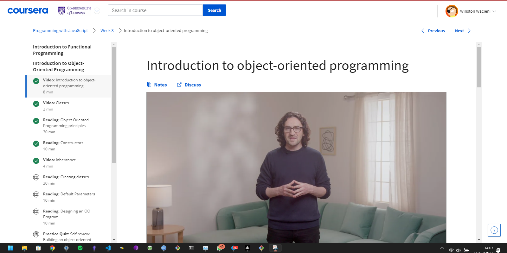

# Project Title

## 📚 Facebook (META) Front-End Development Course on Coursera 🖥️

### Description

This repository contains the code from the Facebook Front-End Development Course on Coursera, an online course that teaches the fundamentals of front-end web development, including HTML, CSS, and JavaScript. The course is designed for beginners who have no prior experience in web development, and it covers a wide range of topics, from basic web design principles to advanced front-end development techniques.

### Installation

To run the code in this repository, you will need to have a text editor, a web browser, and a local server installed on your computer. You can download a text editor like Visual Studio Code or Atom, and a local server like XAMPP or MAMP, for free from their respective websites.

### Usage

After installing the necessary software, you can open the HTML, CSS, and JavaScript files in this repository in your text editor, and then run them on your local server. You can view the web pages in your browser by navigating to localhost:8000 (or a different port number, depending on your local server configuration).

### Contributing

If you find a bug or would like to suggest an improvement, please feel free to submit a pull request or open an issue. We welcome contributions from the community and appreciate any feedback that can help us improve this repository.

### Credits

This repository was created by [Your Name] and is based on the Facebook Front-End Development Course on Coursera. The course was developed by Facebook and is available to anyone for free on the Coursera platform.

### License

This repository is licensed under the MIT license. See the LICENSE file for more information.

### Acknowledgements

We would like to thank Facebook and Coursera for creating and providing this valuable course to the public, and for allowing us to share this code with others who are interested in learning front-end web development. We hope that this repository will be useful to anyone who is looking to learn or improve their skills in this field.

